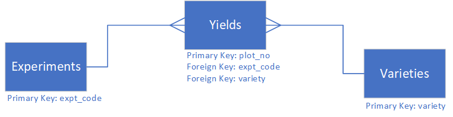

So far we have used the Frictionless Data Table Schema to add metadata to the fields in our dataset table. Using the table schema we can also define primary and foreign key relationships between the tables in our dataset, similar to an SQL database.

The primary key is a field which uniquely identifies every record in a table. The foreign key is a field in one table that refers to a primary key in another table.

The following diagram shows how our three tables are related to each other.

### Adding Primary Keys ###

Using the Frictionless Python module we can add a primary key to a table schema. For example in the yields table, plot_no is the unique identifier for each record so we can make this the primary key.

~~~
yields_schema.schema.primary_key = "plot_no"
pp.pprint(yields_schema)
~~~
{: .language-python}

We now have plot_no identified as the primary key in the JSON schema for the yields table.

~~~
{'encoding': 'utf-8',
 'format': 'csv',
 'hashing': 'md5',
 'name': 'yields',
 'path': 'data/yields.csv',
 'profile': 'tabular-data-resource',
 'schema': {'fields': [{'description': 'A unique identifer for the plot',
                        'name': 'plot_no',
                        'title': 'Plot Number',
                        'type': 'integer'},
                       {'description': 'Institute standard code for a field '
                                       'experiment',
                        'name': 'expt_id',
                        'title': 'Experiment Code',
                        'type': 'string'},
                       {'description': 'Date on which the plot was harvested',
                        'name': 'h_date',
                        'title': 'Harvest Date',
                        'type': 'string'},
                       {'name': 'col_y', 'type': 'integer'},
                       {'name': 'col_x', 'type': 'integer'},
                       {'name': 'variety', 'type': 'string'},
                       {'name': 'grain_weight', 'type': 'number'}],
            'primaryKey': 'plot_no'},
 'scheme': 'file'}
 ~~~
 {: .output}

> ## Exercise
>
> Challenge: Add primary keys to the experiments and varieties table schemas.
>
> Using the code for adding a primary key to the yields table as an example add primary keys to the experiments and varieties table schemas. The primary key for the varieties table is *variety* and for the experiments table is *expt_code*   
>
> > ## Solution
> > ~~~
> > varieties_schema.schema.primary_key = "variety"
> > experiments_schema.schema.primary_key = "expt_code"
> > ~~~
> > {: .language-python}
> > 
> {: .solution}
{: .challenge}

### Adding Foreign Keys ###

With the primary keys defined we can now add foreign keys to the yields table. To add a foreign key we need to pass a JSON string which defines the table and field being referenced. 

The JSON specifies the foreign key field for the table and the referenced table and its primary key field using the following syntax:
~~~
{
    "fields": "FOREIGN-KEY-FIELD-NAME",
    "reference": {
        "resource": "REFERENCED-TABLE-NAME",
        "fields": "REFERENCED-TABLE-PRIMARY-KEY-NAME" 
    }
} 
~~~

> ## Exercise
>
> Challenge: Add foreign keys to the yields table schema.
>
> Complete the following code to make *variety* and *expt_code* foreign keys in the yields table schema. Remember, *variety* reference the varieties table schema and expt_code references the *experiments* table schema. Note we add the keys to the schema as an array.
>
> ~~~
> f_keys = []
> f_keys.append({
>   "fields": "variety",
>   "reference": {
>       "resource": "varieties",        
>       "fields": "variety"
>   }            
> })
> f_keys.append({
>   "fields": "______",
>   "reference": {
>       "resource": "______",        
>       "fields": "______"
>   }            
> })
> yields_schema.schema.foreign_keys = f_keys
> pp.pprint(yields_schema)
> ~~~
> {: .language-python}
>
> > ## Solution
> > ~~~
> > f_keys = []
> > f_keys.append({
> >   "fields": "variety",
> >   "reference": {
> >       "resource": "varieties",        
> >       "fields": "variety"
> >   }            
> > })
> > f_keys.append({
> >   "fields": "expt_code",
> >   "reference": {
> >       "resource": "experiments",        
> >       "fields": "expt_code"
> >   }            
> > })
> > yields_schema.schema.foreign_keys = f_keys
> > pp.pprint(yields_schema)
> > ~~~
> > {: .language-python}
> > 
> > ~~~
> > {'encoding': 'utf-8',
> > 'format': 'csv',
> > 'hashing': 'md5',
> > 'name': 'yields',
> > 'path': 'data/yields.csv',
> > 'profile': 'tabular-data-resource',
> > 'schema': {'fields': [{'description': 'A unique identifer for the plot',
> >                        'name': 'plot_no',
> >                        'title': 'Plot Number',
> >                        'type': 'integer'},
> >                       {'description': 'Institute standard code for a field '
> >                                       'experiment',
> >                        'name': 'expt_id',
> >                        'title': 'Experiment Code',
> >                        'type': 'string'},
> >                       {'description': 'Date on which the plot was harvested',
> >                        'name': 'h_date',
> >                        'title': 'Harvest Date',
> >                        'type': 'string'},
> >                       {'name': 'col_y', 'type': 'integer'},
> >                       {'name': 'col_x', 'type': 'integer'},
> >                       {'name': 'variety', 'type': 'string'},
> >                       {'name': 'grain_weight', 'type': 'number'}],
> >            'foreignKeys': [{'fields': 'variety',
> >                             'reference': {'fields': 'variety',
> >                                           'resource': 'varieties'}},
> >                            {'fields': 'expt_code',
> >                             'reference': {'fields': 'expt_code',
> >                                           'resource': 'experiments'}}],
> >             'primaryKey': 'plot_no'},
> > 'scheme': 'file'}
> > ~~~
> > {: .output}
> {: .solution}
{: .challenge}

